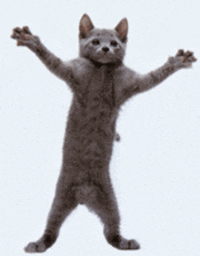

  
   
   
  
<b>Hello I'm Peder and I study natural language processing at the University of Oslo
</b>
   
   
  
   
  
<i>nothing to see here yet sry</i>

  
   
   
  
   
  <a href= "mailto: peder.forland@hotmail.com"> peder.forland@hotmail.com </a>
   
   
   
  
  
  
  
  
  

